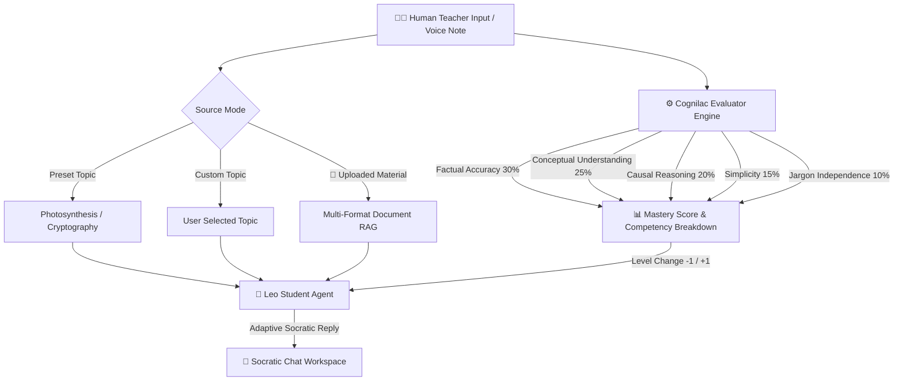

# 🤖 Cognilac — AI Reverse-Tutoring & Socratic Evaluator

**Official Submission for Hack2skill PromptWars x Diksuchi EdTech**

> "Traditional quizzes tell you what you got wrong. Cognilac discovers what you don't actually understand."

Cognilac flips the traditional classroom model. Instead of an AI tutoring a human, **you become the teacher** and explain complex STEM topics to **Leo** (a curious 10-year-old AI student powered by Google Gemini). In parallel, a hidden **Cognilac Evaluator** silently grades your explanation across five weighted pedagogical metrics, detecting knowledge gaps and simplifying complex concepts in real-time.

---

🚀 **Live Demo:**  
👉 [https://nlp-sentiment-analyzer-2026.streamlit.app ](https://cognilac-reverse-tutoring-platform.onrender.com/)

## 🏆 Hackathon Challenge Alignment

| Metric | Details |
|---|---|
| **Event** | Hack2skill PromptWars x Diksuchi EdTech |
| **Challenge Vertical** | AI Reverse-Tutoring & Adaptive Socratic STEM Learning |
| **Target Persona** | Student / Teacher Pair (Human Teacher explaining to a 10-year-old AI student) |
| **Pedagogical Rationale** | Applies the Feynman Technique: You truly understand a topic only if you can teach it simply to a child. |

---

## 🗺️ Architectural Workflow & Sequence



---

## 💡 Assumptions Made

1. **Target Audience**: Designed for self-directed learners, students, and educators seeking deep conceptual mastery rather than rote memorization.
2. **AI Multimodal Capabilities**: Assumes Google Gemini 2.5 Flash is available for structured JSON evaluations and speech-to-text audio transcriptions. When offline or unauthenticated, the system seamlessly falls back to dynamic algorithmic heuristics.
3. **Document Context Capping**: Assumes uploaded study documents (PDF, DOCX, TXT, PPTX, CSV/XLSX) can be chunked using TF-IDF term matching for real-time turn grounding.

---

## 🔒 Security & Accessibility Features (WCAG 2.1 AAA Compliant)

1. **Secret & Key Protection**: Secrets are loaded via `.env` using `python-dotenv`. `.env` and sensitive files are strictly excluded from Git (`.gitignore`) and Docker builds (`.dockerignore`).
2. **Input Sanitization & Rate Limits**: User inputs and topic parameters strip null bytes and non-printable control characters. Input lengths are capped at 1,500 characters, and chat sessions are capped at 30 turns.
3. **Accessibility (WCAG 2.1 AAA)**: Includes explicit WAI-ARIA landmarks (`role="main"`, `role="banner"`, `role="region"`), high-contrast text color palettes, keyboard focus outlines (`:focus-visible`), and screen reader support.

---

## 🧪 Automated Testing & Code Quality

Run the automated unit test suite:

```bash
python -m unittest discover -s tests
```

Coverage includes:
- `tests/test_config.py`: Topic normalization & preset lookups
- `tests/test_agents.py`: Leo Agent prompt generation & input sanitization
- `tests/test_evaluator.py`: Deterministic score calculations & offline evaluator
- `tests/test_document_processor.py`: Multi-format text extraction & audio transcription

---

## 🛠 Local Quickstart & Deployment

1. **Install Dependencies**:
   ```bash
   pip install -r requirements.txt
   ```
2. **Set Environment Variable**:
   ```env
   GEMINI_API_KEY=your_gemini_api_key_here
   ```
3. **Run Application**:
   ```bash
   streamlit run app.py
   ```

---

## 📜 License & Acknowledgements

Built for **Hack2skill PromptWars x Diksuchi EdTech**, powered by **Google Gemini** and **Streamlit**.
